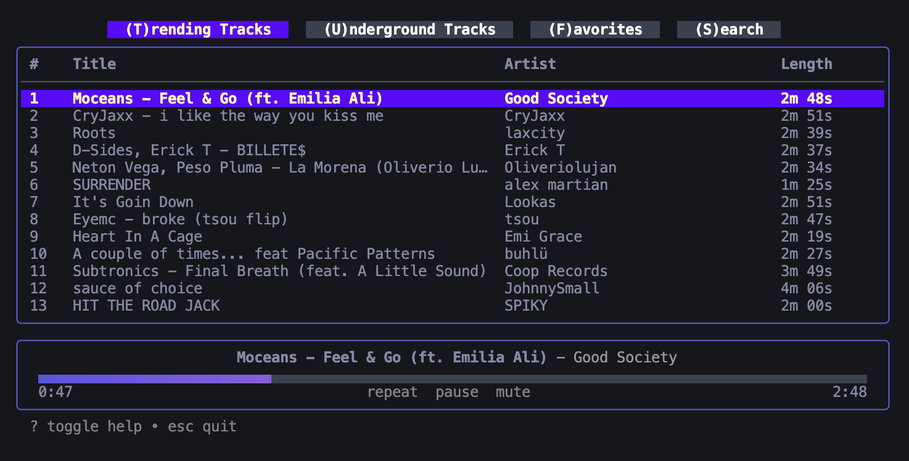
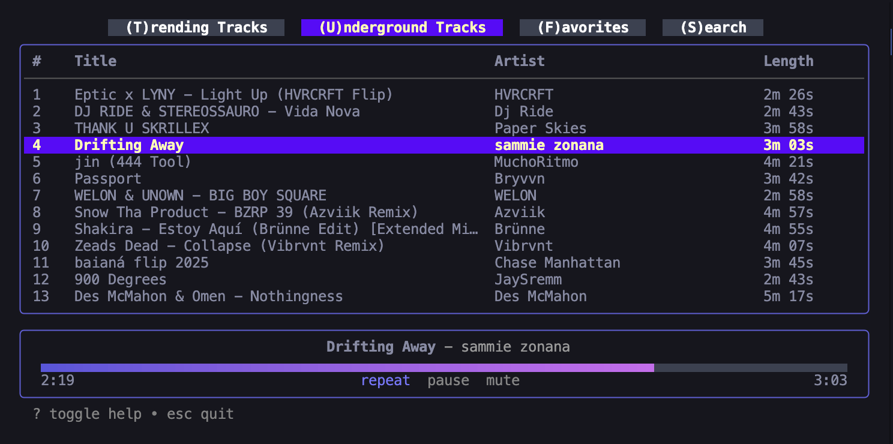
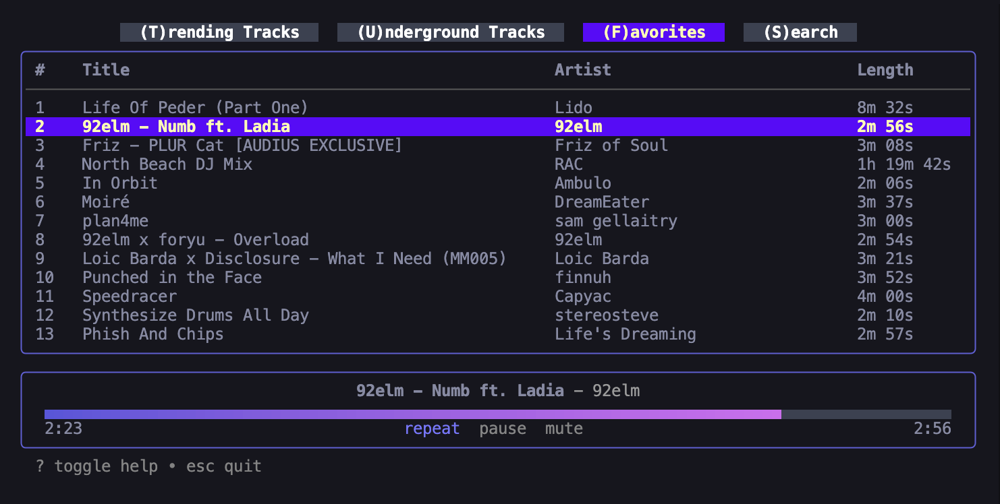
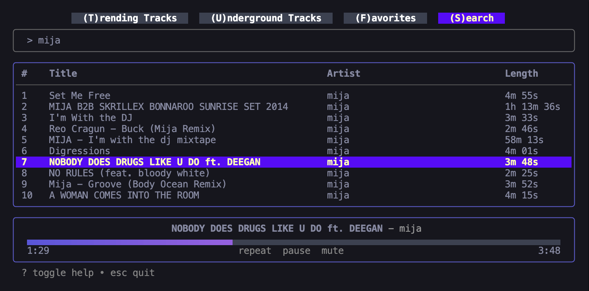

# Audius Terminal Player

A music player to steam and discover music on Audius directly from your terminal, written in Go.

## Installation

```bash
go install github.com/Kyle-Shanks/audius_cli_player_test@latest
```

## Usage

```bash
audius_cli_player_test
```

## Features

- Stream music directly from Audius
- View track details in the play bar
- Search across the Audius catalog
- Mouse support for progress bar seeking
- Keyboard-based navigation

## Views

- 🎵 **Trending [T]**
  
  - See whats trending on Audius
  - The next track will queue automatically while you work
- 🎧 **Underground Trending [U]**
  
  - Discover your new favorite artist
- ❤️ **Favorites [F]**
  
  - All your favorites in one place
  - Press `=` to enter in your Audius handle and enable this view
- 🔍 **Search [S]**
  
  - Search for tracks and artists across Audius
  - Press `Tab` to switch between the input and track list

## Keyboard Shortcuts

- **Global**
  - `T` - Switch to Trending Tracks
  - `U` - Switch to Underground Tracks
  - `F` - Switch to Favorites
  - `S` - Switch to Search
  - `Space/p` - Play/Pause
  - `m` - Mute/Unmute
  - `r` - Toggle Repeat
  - `?` - Toggle help
  - `/` - Search
  - `=` - Enter User Handle
  - `Esc/q/Ctrl+C` - Quit

- **List**
  - `Enter` - Play track
  - `j/↓` - Move down
  - `k/↑` - Move up
  - `d` - Down half page
  - `u` - Up half page
  - `f` - Down full page
  - `b` - Up full page
  - `g` - Go to top of list
  - `G` - Go to bottom of list

---

> **Note:** Longer tracks may take a few seconds to load before playback begins. This is normal behavior as the player downloads the audio data.
